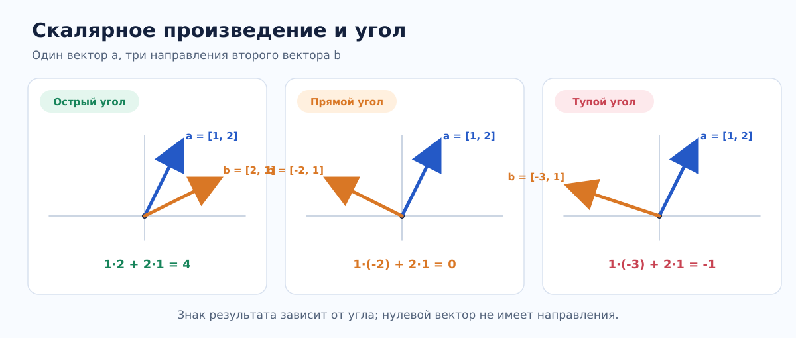
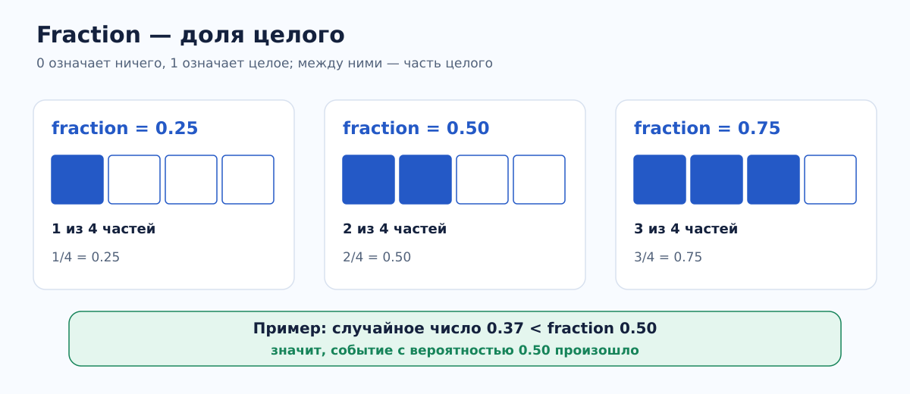
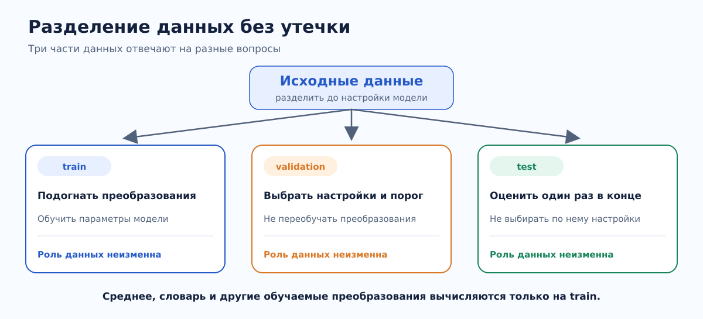
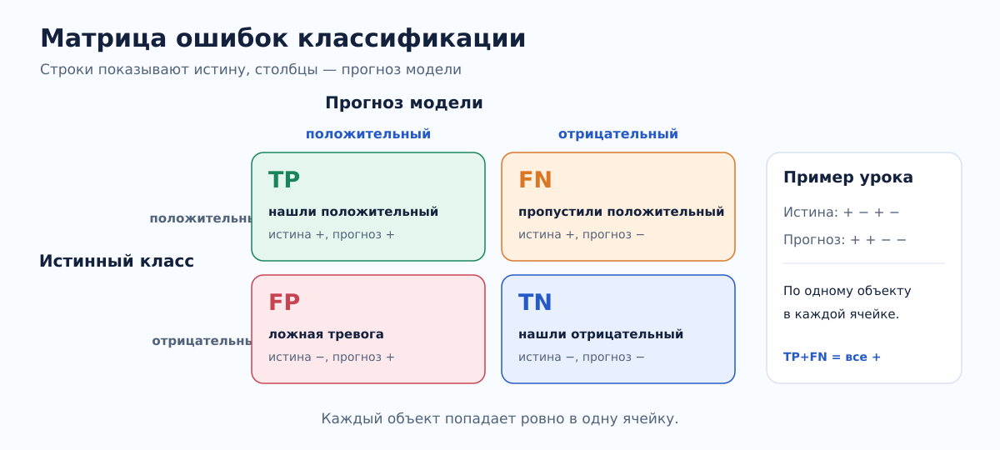
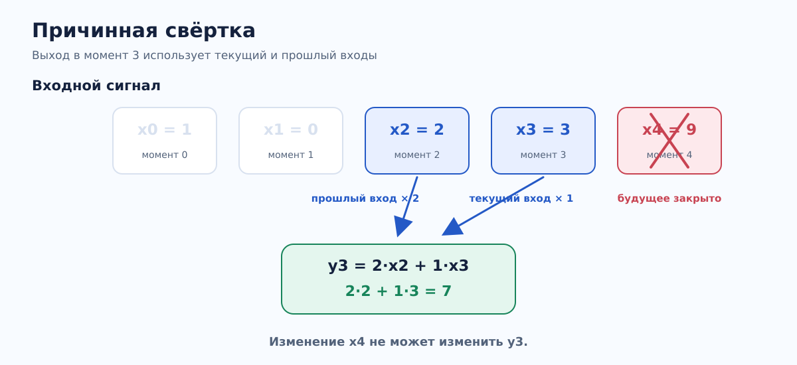
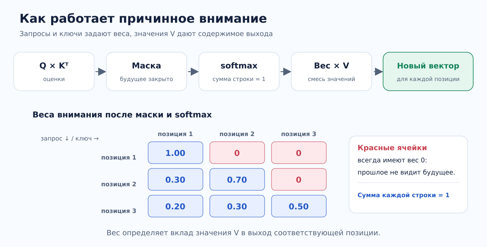
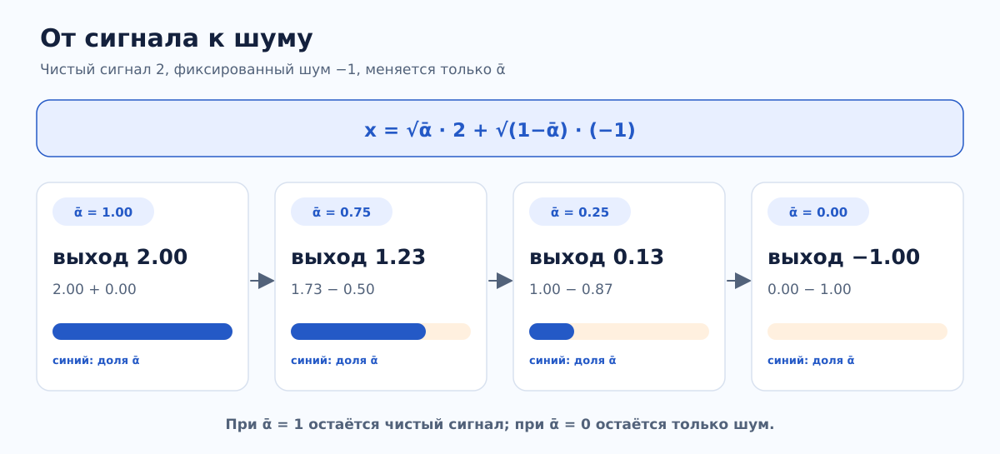

# Пошаговый план изучения AI и машинного обучения на Rust

## Для кого и как проходить

План рассчитан на человека, который уверенно пишет на Rust, но начинает AI и ML с нуля. Цель — понять математику, обучение моделей, честную оценку качества и инженерный путь от данных до работающего приложения. Последовательность намеренно идёт от реализаций своими руками к более крупным системам. Это учебные задачи: после понимания алгоритма можно заменить ручную реализацию библиотекой и сравнить результаты.

**Ритм:** 47 последовательных блоков и 236 исполняемых пакетов. Узкие уроки переходят к сводной практике, затем к двум итоговым проектам. Пакеты лежат прямо в корне workspace; формулы, впервые введённые в библиотеке урока, используются дальше через локальные зависимости. Запускай пакет командой `cargo run -p ИМЯ_ПАКЕТА`, весь курс проверяй `cargo check --workspace`.

**Как работать:** внутри блока запускай узкие пакеты в порядке таблицы, заранее предсказывай вывод и меняй входные данные по одной переменной. В уроке 01.1 сравни случаи с острым, прямым и тупым углом, противоположным направлением и нулевым вектором: одинаковый нулевой ответ возможен по разным причинам. В других уроках также смотри на разные исходы и граничные входы, которые программа выводит рядом. После них запускай сводную практику и объясняй, как изученные части соединяются. Запускай конкретный пакет через `cargo run -p ИМЯ_ПАКЕТА`; весь workspace проверяй `cargo check --workspace` и `cargo fmt --all -- --check`. Результаты и выводы можно записывать в README пакета. Каждая обучаемая модель должна иметь baseline, данные для проверки вне обучения, фиксированный seed там, где есть случайность, и явное описание ошибок.

**Самопроверка:** после каждого пакета выполни [задачу для этого урока](SELF_CHECK.md). Для всех 236 пакетов рядом с задачей указано, как проверить результат и что нужно суметь объяснить своими словами, чтобы считать урок пройденным. Затем поставь галочку в [списке прогресса](PROGRESS.md).

**Перед кодом:** для первых шести блоков прочитай [короткие объяснения, ручные примеры и словарь](FOUNDATIONS.md). После каждого пункта воспроизведи расчёт без подсказки, затем перейди к программе и самопроверке.

**Данные и зависимости:** для первых уроков используй небольшие синтетические наборы, которые можно проверить вручную. Затем добавь локальный CSV с понятным происхождением и лицензией. Не храни в Git большие датасеты и веса. Начни со стандартной библиотеки Rust; подключай crates для CSV, линейной алгебры, графиков или тензоров тогда, когда ручная реализация уже прояснила идею. Время и память важны, но сначала проверь правильность. Rust-уроки работают без Python; стандартная библиотека Python нужна только скрипту подготовки открытых датасетов. При желании используй Python как независимую проверку чисел.

**Открытые датасеты:** для практики на реальных данных открой [готовые команды скачивания, типы Rust и три запускаемых примера](DATASETS.md). Подготовка выполняется одной командой `python3 scripts/prepare_open_datasets.py all`; Python нужен только для скачивания и преобразования файлов, сами уроки и примеры запускаются на Rust.

**Математика в примерах:** узкий пакет показывает одну идею на малых числах; сводная практика соединяет идеи блока. Повторно используемые формулы вынесены в публичные функции `src/lib.rs` соответствующего урока; вычисление с единственным местом вызова остаётся прямо в `main`. Когда примеру нужна общая функция своего урока, `main` обращается к ней через библиотеку пакета. Корень считается методом Ньютона, экспонента и логарифм — рядами. Производные и градиенты выделены отдельно от шага обучения. Эти реализации рассчитаны на небольшие учебные входы; проверь их на известных значениях и учитывай численную погрешность.

**Графики:** там, где величины удобно сравнивать визуально, запуск пакета создаёт SVG в его каталоге `visualizations/` и печатает полный путь к файлу. Например, `cargo run -p part-019-lesson-04-learning-rate-for-gradient-descent-update` создаёт график ошибки для разных скоростей обучения. Открой SVG в браузере или редакторе изображений. Графики строятся через общий пакет `lesson-visualization` на основе Plotters; файлы в `visualizations/` не добавляются в Git. Уроки про схемы, конфигурацию, версии файлов и текстовые контракты могут обходиться без графика.

**Правило оценки:** train служит для подгонки параметров, validation — для выбора гиперпараметров и порога, test — для одного итогового отчёта. Статистики нормализации, словарь и любые преобразования, обучаемые на данных, рассчитывай только по train. Храни размер каждой части, seed и метрику рядом с результатом.

## Карта курса

| Раздел | Блоки | Результат |
|---|---:|---|
| I. Математика и данные | 01–08 | Геометрия, оптимизация, вероятность, подготовка данных |
| II. Классическое ML | 09–19 | Регрессия, деревья, CatBoost, оценка и PCA |
| III. Нейросети и представления | 20–32 | MLP, RNN, WaveNet, токены, поиск, внимание, Transformer |
| IV. Современные архитектуры и AI-задачи | 33–42 | ViT, BERT, GPT, Qwen, RAG, диффузия, SSM, RL |
| V. Инженерия и итоговые проекты | 43–47 | Сохранение, инференс, мониторинг, два проекта |

## Почему темы переставлены и дополнены

- Подготовка данных сначала вводит разбиение на train/validation/test, затем заполнение пропусков и кодирование категорий только по train.
- Bootstrap-выборка предшествует bagging; CatBoost следует за деревьями и ансамблями; ViT следует за общим Transformer и свёртками; RNN предшествует WaveNet.
- Byte-level BPE идёт перед эмбеддингами. Биграммная языковая модель и простой поиск предшествуют вниманию. После общего Transformer изучаются ViT, двунаправленный encoder, авторегрессионный GPT и компоненты Qwen3.
- Для обучаемых моделей добавлены численная проверка градиента через время, отложенная оценка выходной головы GPT, LoRA и ошибка квантования. Диффузия включает прямой и обратный шаг, а селективная память сравнивается с фиксированной.
- Два итоговых проекта находятся после архитектурных и инженерных блоков, чтобы в них можно было использовать весь материал курса.

Порядок split → обучение преобразований на train соответствует [рекомендациям scikit-learn](https://scikit-learn.org/1.8/common_pitfalls.html). Переход от механизма внимания к Transformer и затем к ViT соответствует [порядку изложения Dive into Deep Learning](https://www.d2l.ai/chapter_attention-mechanisms-and-transformers/index.html).

## Тематические блоки и уроки

### I. Математика и данные

#### 01. Векторы и геометрия

Изучай каждое понятие отдельно, затем объедини их в сводной практике.
[Объяснения и ручные примеры для блока 01](FOUNDATIONS.md#01-векторы-и-геометрия).

| Шаг | Отдельная тема | Пакет |
|---:|---|---|
| 1 | Урок 01.1. Умножение соответствующих координат двух векторов и сложение произведений | `part-001-lesson-01-multiply-matching-coordinates-of-two-vectors-then-add` |
| 2 | Урок 01.2. Сумма модулей координат одного вектора (норма L1) | `part-002-lesson-01-sum-absolute-values-of-vector-coordinates` |
| 3 | Вычисление евклидовой длины одного вектора | `part-003-lesson-01-calculate-euclidean-length-of-one-vector` |
| 4 | Урок 01.4. Евклидово расстояние между точками | `part-004-lesson-01-euclidean-distance-between-two-points` |
| 5 | Урок 01.5. Косинусное сходство двух векторов | `part-005-lesson-01-cosine-similarity-between-two-vectors` |

*Проверь себя: почему результат 0 для вектора [-2, 1] не означает, что сам вектор нулевой?*

##### Сводная практика: скалярное произведение, нормы, расстояние и косинус двух векторов — `part-006-lesson-01-practice-vector-dot-product-norms-distance-and-cosine`

- **Повторить вместе:** умножение координат попарно и сложение результатов, нормы L1/L2, расстояние, косинусное сходство.
- **Практика:** Реализуй Vec<f64>: multiply_matching_coordinates_of_two_vectors_then_add, norm, distance, cosine; опиши ошибки длины и нулевого вектора.
- **Готово, когда:** Сравни ортогональные, одинаковые и противоположные векторы; проверь симметрию расстояния.
- **Артефакт:** код пакета, короткий README с входными данными, командой запуска, результатом и тем, что осталось непонятным.

#### 02. Матрицы и линейные преобразования

Изучай каждое понятие отдельно, затем объедини их в сводной практике.
[Объяснения и ручные примеры для блока 02](FOUNDATIONS.md#02-матрицы).

| Шаг | Отдельная тема | Пакет |
|---:|---|---|
| 1 | Проверка числа элементов матрицы и границ строки и столбца | `part-007-lesson-02-validate-matrix-element-count-and-row-column-indices` |
| 2 | Перестановка строк матрицы в столбцы | `part-008-lesson-02-transpose-matrix-rows-into-columns` |
| 3 | Умножение матрицы на вектор через скалярные произведения строк | `part-009-lesson-02-multiply-matrix-by-vector-using-row-dot-products` |
| 4 | Умножение двух матриц через скалярные произведения строк и столбцов | `part-010-lesson-02-multiply-two-matrices-using-row-column-dot-products` |
| 5 | Решение системы двух линейных уравнений | `part-011-lesson-02-solve-system-of-two-linear-equations` |

##### Сводная практика: форма матрицы, транспонирование, произведения и система уравнений — `part-012-lesson-02-practice-matrix-shapes-transpose-products-and-linear-system`

- **Повторить вместе:** формы матриц, транспонирование, матричное умножение, системы уравнений.
- **Практика:** Сделай Matrix с проверкой размерностей, transpose, matmul и matvec без внешних библиотек.
- **Готово, когда:** Проверь единичную матрицу, несовместимые формы и несколько результатов умножения матриц, вычисленных вручную.
- **Артефакт:** код пакета, короткий README с входными данными, командой запуска, результатом и тем, что осталось непонятным.

#### 03. Производные и градиент

Изучай каждое понятие отдельно, затем объедини их в сводной практике.
[Объяснения и ручные примеры для блока 03](FOUNDATIONS.md#03-производные).

| Шаг | Отдельная тема | Пакет |
|---:|---|---|
| 1 | Производная функции одной переменной | `part-013-lesson-03-derivative-of-single-variable-function` |
| 2 | Частная производная функции двух переменных | `part-014-lesson-03-partial-derivative-of-two-variable-function` |
| 3 | Правило цепочки для производной композиции функций | `part-015-lesson-03-chain-rule-for-derivative-of-composed-functions` |
| 4 | Градиент функции двух переменных | `part-016-lesson-03-gradient-of-two-variable-function` |
| 5 | Приближение производной функции центральной разностью | `part-017-lesson-03-approximate-function-derivative-with-central-difference` |

##### Сводная практика: производные, правило цепочки, градиент и конечные разности — `part-018-lesson-03-practice-derivatives-chain-rule-gradient-and-finite-differences`

- **Повторить вместе:** производная, частная производная, правило цепочки, градиент, численная разность.
- **Практика:** Для f(x,y)=(x−2)²+3(y+1)² реализуй аналитический и численный градиенты.
- **Готово, когда:** Сравни градиенты при разных eps; объясни ошибку округления и ошибку аппроксимации.
- **Артефакт:** код пакета, короткий README с входными данными, командой запуска, результатом и тем, что осталось непонятным.

#### 04. Градиентный спуск

Изучай каждое понятие отдельно, затем объедини их в сводной практике.
[Объяснения и ручные примеры для блока 04](FOUNDATIONS.md#04-градиентный-спуск).

| Шаг | Отдельная тема | Пакет |
|---:|---|---|
| 1 | Скорость обучения в шаге градиентного спуска | `part-019-lesson-04-learning-rate-for-gradient-descent-update` |
| 2 | Сходимость последовательности шагов градиентного спуска | `part-020-lesson-04-convergence-of-gradient-descent-steps` |
| 3 | Локальные минимумы невыпуклой функции | `part-021-lesson-04-local-minima-of-nonconvex-function` |
| 4 | Пакетное и стохастическое обновление по градиенту | `part-022-lesson-04-batch-versus-stochastic-gradient-updates` |

##### Сводная практика: скорость обучения, сходимость и режимы градиентного спуска — `part-023-lesson-04-practice-gradient-descent-learning-rate-convergence-and-update-modes`

- **Повторить вместе:** скорость обучения, сходимость, локальные минимумы, batch и stochastic updates.
- **Практика:** Минимизируй квадратичную функцию и запиши историю loss для нескольких learning rate.
- **Готово, когда:** Покажи успешный, медленный и расходящийся запуск; критерий остановки не должен зависеть только от числа шагов.
- **Артефакт:** код пакета, короткий README с входными данными, командой запуска, результатом и тем, что осталось непонятным.

#### 05. Вероятность и моделирование

Изучай каждое понятие отдельно, затем объедини их в сводной практике.
[Объяснения и ручные примеры для блока 05](FOUNDATIONS.md#05-вероятность).

| Шаг | Отдельная тема | Пакет |
|---:|---|---|
| 1 | Условная вероятность одного события при наступлении другого | `part-024-lesson-05-conditional-probability-of-one-event-given-another` |
| 2 | Независимость двух событий | `part-025-lesson-05-independence-of-two-events` |
| 3 | Пересчёт вероятности события после наблюдения по формуле Байеса | `part-026-lesson-05-bayes-update-of-event-probability-after-observation` |
| 4 | Математическое ожидание дискретных случайных исходов | `part-027-lesson-05-expected-value-of-discrete-random-outcomes` |

*Проверь себя: чему равна fraction, если взяты три из четырёх равных частей?*

##### Сводная практика: условная вероятность, формула Байеса и ожидание — `part-028-lesson-05-practice-conditional-probability-bayes-and-expected-value`

- **Повторить вместе:** условная вероятность, независимость, формула Байеса, математическое ожидание.
- **Практика:** Смоделируй броски монеты и тест болезни с известной чувствительностью и специфичностью.
- **Готово, когда:** Сравни частоты с теоретическими значениями и объясни влияние базовой частоты события.
- **Артефакт:** код пакета, короткий README с входными данными, командой запуска, результатом и тем, что осталось непонятным.

#### 06. Выборочная статистика

Изучай каждое понятие отдельно, затем объедини их в сводной практике.
[Объяснения и ручные примеры для блока 06](FOUNDATIONS.md#06-статистика-по-выборке).

| Шаг | Отдельная тема | Пакет |
|---:|---|---|
| 1 | Среднее арифметическое числовых значений | `part-029-lesson-06-arithmetic-mean-of-numeric-values` |
| 2 | Медиана числовых значений | `part-030-lesson-06-median-of-numeric-values` |
| 3 | Выборочная дисперсия числовых значений | `part-031-lesson-06-sample-variance-of-numeric-values` |
| 4 | Квантиль упорядоченных числовых значений | `part-032-lesson-06-quantile-of-sorted-numeric-values` |
| 5 | Доверительный интервал для среднего генеральной совокупности | `part-033-lesson-06-confidence-interval-for-population-mean` |
| 6 | Повторные выборки с возвращением из наблюдений | `part-034-lesson-06-bootstrap-resampling-of-observed-values` |

##### Сводная практика: среднее, медиана и выборочная дисперсия из CSV — `part-035-lesson-06-practice-mean-median-and-sample-variance-from-csv`

- **Повторить вместе:** среднее, медиана, дисперсия, квантили, доверительный интервал, bootstrap.
- **Практика:** Напиши статистический отчёт по CSV-столбцу; отдельно обработай пропуски и нечисловые значения.
- **Готово, когда:** Проверь на малом наборе вручную; сравни интервалы bootstrap при разных размерах выборки.
- **Артефакт:** код пакета, короткий README с входными данными, командой запуска, результатом и тем, что осталось непонятным.

#### 07. Данные и признаки

Изучай каждое понятие отдельно, затем объедини их в сводной практике.

| Шаг | Отдельная тема | Пакет |
|---:|---|---|
| 1 | Проверка заголовка CSV по схеме данных | `part-036-lesson-07-validate-csv-header-against-data-schema` |
| 2 | Разбор числового и категориального признаков из строки CSV | `part-037-lesson-07-parse-numeric-and-categorical-features-from-csv-row` |
| 3 | Разделение набора данных на обучение, валидацию и тест | `part-038-lesson-07-split-dataset-into-training-validation-and-test-sets` |
| 4 | Заполнение пропусков признака медианой обучающих данных | `part-039-lesson-07-impute-missing-feature-values-using-training-median` |
| 5 | Кодирование категорий, изученных на обучающих данных | `part-040-lesson-07-encode-categories-learned-from-training-data` |
| 6 | Утечка информации из тестовых данных в обучение | `part-041-lesson-07-data-leakage-from-test-set-into-training` |

*Проверь себя: по какой части данных нужно вычислять среднее для заполнения пропусков?*

##### Сводная практика: схема данных, типы признаков, разбиение и подготовка без утечки — `part-042-lesson-07-practice-data-schema-feature-types-splits-and-leakage-free-pipeline`

- **Повторить вместе:** схема данных, типы признаков, заполнение пропусков, категории, train/validation/test, утечка данных.
- **Практика:** Прочитай локальный CSV, проверь схему, разбей данные с seed; вычисляй параметры нормализации только на train.
- **Готово, когда:** Проверь отсутствие пересечений между частями и повторяемость разбиения.
- **Артефакт:** код пакета, короткий README с входными данными, командой запуска, результатом и тем, что осталось непонятным.

#### 08. Воспроизводимый эксперимент

Изучай каждое понятие отдельно, затем объедини их в сводной практике.

| Шаг | Отдельная тема | Пакет |
|---:|---|---|
| 1 | Начальное число для воспроизводимой псевдослучайной последовательности | `part-043-lesson-08-seed-for-reproducible-random-sequence` |
| 2 | Базовый классификатор по наиболее частому классу | `part-044-lesson-08-majority-class-baseline-classifier` |
| 3 | Конфигурация эксперимента из аргументов командной строки | `part-045-lesson-08-experiment-configuration-from-command-line-arguments` |
| 4 | Запись значения метрики по эпохам обучения | `part-046-lesson-08-record-training-metric-by-epoch` |
| 5 | Отпечаток содержимого набора данных для контроля версии | `part-047-lesson-08-fingerprint-dataset-content-for-versioning` |

##### Сводная практика: воспроизводимый эксперимент с базовой моделью и версией данных — `part-048-lesson-08-practice-reproducible-experiment-with-seed-baseline-and-data-version`

- **Повторить вместе:** seed, baseline, конфигурация, журнал метрик, версии данных.
- **Практика:** Создай CLI с параметрами seed и пути к данным; сохрани конфигурацию, метрики и хеш входного файла.
- **Готово, когда:** Два запуска с одинаковыми входами дают одинаковый результат; изменение seed отражается в отчёте.
- **Артефакт:** код пакета, короткий README с входными данными, командой запуска, результатом и тем, что осталось непонятным.

### II. Классическое ML

#### 09. Линейная регрессия

Для реальной задачи с 11 числовыми признаками подготовь [Wine Quality](DATASETS.md#wine-quality-регрессия) и сравни свою модель с готовым baseline.

Изучай каждое понятие отдельно, затем объедини их в сводной практике.

| Шаг | Отдельная тема | Пакет |
|---:|---|---|
| 1 | Средний квадрат разности правильных ответов и прогнозов | `part-049-lesson-09-mean-squared-error-between-targets-and-predictions` |
| 2 | Средний модуль разности правильных ответов и прогнозов | `part-050-lesson-09-mean-absolute-error-between-targets-and-predictions` |
| 3 | Вес и смещение линейной регрессионной модели | `part-051-lesson-09-weights-and-bias-of-linear-regression-model` |
| 4 | Штраф за большой вес линейной модели | `part-052-lesson-09-regularization-penalty-for-linear-model-weight` |
| 5 | Оценка линейной регрессии на отложенных данных | `part-053-lesson-09-evaluate-linear-regression-on-heldout-data` |

##### Сводная практика: линейная регрессия, ошибки и оценка на отложенных данных — `part-054-lesson-09-practice-linear-regression-with-errors-coefficients-and-heldout-evaluation`

- **Повторить вместе:** MSE, MAE, коэффициенты, регуляризация, качество на отложенных данных.
- **Практика:** Обучи y=wx+b градиентным спуском на синтетических данных; сравни с константным baseline.
- **Готово, когда:** Проверь восстановление известных w,b без шума и рост ошибки при сильной регуляризации.
- **Артефакт:** код пакета, короткий README с входными данными, командой запуска, результатом и тем, что осталось непонятным.

#### 10. Логистическая регрессия

Изучай каждое понятие отдельно, затем объедини их в сводной практике.

| Шаг | Отдельная тема | Пакет |
|---:|---|---|
| 1 | Преобразование логита в вероятность класса сигмоидой | `part-055-lesson-10-sigmoid-map-from-logit-to-class-probability` |
| 2 | Логарифмическая ошибка по правильному ответу и прогнозной вероятности | `part-056-lesson-10-binary-logarithmic-loss-from-target-and-predicted-probability` |
| 3 | Вероятность положительного класса из логистической модели | `part-057-lesson-10-positive-class-probability-from-logistic-model` |
| 4 | Преобразование прогнозной вероятности в класс по порогу | `part-058-lesson-10-convert-predicted-probability-to-class-using-threshold` |

##### Сводная практика: логистическая регрессия, сигмоида, ошибка и порог — `part-059-lesson-10-practice-logistic-regression-with-sigmoid-loss-and-class-threshold`

- **Повторить вместе:** сигмоида, log-loss, вероятности, порог классификации.
- **Практика:** Реализуй бинарный классификатор и стабильный расчёт log-loss без log(0).
- **Готово, когда:** Проверь вероятности в [0,1], улучшение loss и влияние порога на precision/recall.
- **Артефакт:** код пакета, короткий README с входными данными, командой запуска, результатом и тем, что осталось непонятным.

#### 11. Метрики и дисбаланс классов

Изучай каждое понятие отдельно, затем объедини их в сводной практике.

| Шаг | Отдельная тема | Пакет |
|---:|---|---|
| 1 | Матрица ошибок бинарной классификации по истинным и прогнозным меткам | `part-060-lesson-11-binary-classification-confusion-matrix-from-true-and-predicted-labels` |
| 2 | Точность положительных прогнозов по счётчикам бинарной классификации | `part-061-lesson-11-precision-from-binary-classification-counts` |
| 3 | Полнота положительного класса по счётчикам бинарной классификации | `part-062-lesson-11-recall-from-binary-classification-counts` |
| 4 | Гармоническое среднее точности и полноты бинарной классификации | `part-063-lesson-11-harmonic-mean-of-binary-classification-precision-and-recall` |
| 5 | Площадь под ROC кривой по парам положительных и отрицательных оценок | `part-064-lesson-11-area-under-roc-curve-from-positive-negative-score-pairs` |
| 6 | Площадь под кривой точности и полноты по оценкам бинарного классификатора | `part-065-lesson-11-area-under-precision-recall-curve-for-binary-scores` |

*Проверь себя: в какую ячейку попадает положительный объект, если модель предсказала отрицательный класс?*

##### Сводная практика: метрики бинарной классификации при дисбалансе классов — `part-066-lesson-11-binary-classification-metrics-under-class-imbalance`

- **Повторить вместе:** confusion matrix, precision, recall, F1, ROC-AUC, PR-AUC.
- **Практика:** Рассчитай метрики из меток и оценок; добавь подбор порога по validation.
- **Готово, когда:** Покажи набор, где accuracy высока у бесполезного классификатора; не подбирай порог на test.
- **Артефакт:** код пакета, короткий README с входными данными, командой запуска, результатом и тем, что осталось непонятным.

#### 12. Метод ближайших соседей

Изучай каждое понятие отдельно, затем объедини их в сводной практике.

После ручных примеров запусти [Iris с настоящими измерениями цветков](DATASETS.md#iris-классификация-и-геометрия).

| Шаг | Отдельная тема | Пакет |
|---:|---|---|
| 1 | Квадрат расстояния по признакам для поиска ближайших соседей | `part-067-lesson-12-squared-feature-distance-for-nearest-neighbors` |
| 2 | Масштабирование признаков перед вычислением расстояния до соседей | `part-068-lesson-12-scale-features-before-nearest-neighbor-distance` |
| 3 | Выбор числа соседей для классификации kNN | `part-069-lesson-12-choose-number-of-neighbors-for-knn-classification` |
| 4 | Стоимость прогноза kNN при сравнении со всеми обучающими точками | `part-070-lesson-12-cost-of-knn-prediction-over-training-points` |

##### Сводная практика: классификация kNN с масштабированием признаков и выбором k — `part-071-lesson-12-practice-knn-classification-with-scaled-features-and-chosen-k`

- **Повторить вместе:** расстояния, масштабирование признаков, выбор k, стоимость предсказания.
- **Практика:** Напиши k-NN классификатор с явным правилом разрешения ничьей.
- **Готово, когда:** Сравни k=1 и большие k; продемонстрируй эффект признака с большой шкалой.
- **Артефакт:** код пакета, короткий README с входными данными, командой запуска, результатом и тем, что осталось непонятным.

#### 13. Наивный Байес

Изучай каждое понятие отдельно, затем объедини их в сводной практике.

Для текстовой классификации подготовь [SMS Spam Collection](DATASETS.md#sms-spam-текст-и-несбалансированные-классы) и сравни свой метод с baseline большинства.

| Шаг | Отдельная тема | Пакет |
|---:|---|---|
| 1 | Условная независимость признаков при известном классе | `part-072-lesson-13-conditional-independence-of-features-given-class` |
| 2 | Априорные вероятности классов по обучающим данным | `part-073-lesson-13-prior-probabilities-of-classes-in-training-data` |
| 3 | Сглаживание Лапласа для частот слов при известном классе | `part-074-lesson-13-laplace-smoothing-of-class-conditional-word-counts` |

##### Сводная практика: наивный Байес с априорными вероятностями и сглаживанием — `part-075-lesson-13-practice-naive-bayes-with-class-priors-and-laplace-smoothing`

- **Повторить вместе:** условная независимость, априорные вероятности, сглаживание Лапласа.
- **Практика:** Обучи мультиномиальный классификатор коротких текстов по счётчикам слов.
- **Готово, когда:** Проверь неизвестные слова и класс с редкими токенами; считай вероятности в log-пространстве.
- **Артефакт:** код пакета, короткий README с входными данными, командой запуска, результатом и тем, что осталось непонятным.

#### 14. Дерево решений

Изучай каждое понятие отдельно, затем объедини их в сводной практике.

| Шаг | Отдельная тема | Пакет |
|---:|---|---|
| 1 | Энтропия долей классов в узле дерева решений | `part-076-lesson-14-entropy-of-class-proportions-in-tree-node` |
| 2 | Нечистота Джини по долям классов в узле дерева решений | `part-077-lesson-14-gini-impurity-of-class-proportions-in-tree-node` |
| 3 | Жадный выбор порога для разбиения дерева решений | `part-078-lesson-14-greedy-threshold-split-for-decision-tree` |
| 4 | Переобучение из-за чрезмерной глубины дерева решений | `part-079-lesson-14-overfitting-from-excessive-decision-tree-depth` |

##### Сводная практика: дерево решений, меры нечистоты, разбиения и ограничение глубины — `part-080-lesson-14-practice-decision-tree-with-impurity-splits-and-depth-control`

- **Повторить вместе:** энтропия, Gini, жадное разбиение, переобучение.
- **Практика:** Реализуй дерево для числовых признаков: выбор порога, max_depth, min_samples_leaf.
- **Готово, когда:** Проверь чистый лист, константный признак и изменение train/test метрик с глубиной.
- **Артефакт:** код пакета, короткий README с входными данными, командой запуска, результатом и тем, что осталось непонятным.

#### 15. Ансамбли

Изучай каждое понятие отдельно, затем объедини их в сводной практике.

| Шаг | Отдельная тема | Пакет |
|---:|---|---|
| 1 | Выборка с возвращением для обучения ансамбля | `part-081-lesson-15-bootstrap-sample-with-replacement-for-ensemble` |
| 2 | Обучение моделей на разных выборках с возвращением | `part-082-lesson-15-bagging-models-trained-on-bootstrap-samples` |
| 3 | Голосование большинства по бинарным прогнозам моделей | `part-083-lesson-15-majority-vote-over-binary-model-predictions` |
| 4 | Смещение и разброс прогнозов модели | `part-084-lesson-15-bias-and-variance-of-model-predictions` |

##### Сводная практика: ансамбль с выборками с возвращением и голосованием — `part-085-lesson-15-practice-bootstrap-bagging-and-majority-vote-ensemble`

- **Повторить вместе:** bagging, bootstrap, majority vote, bias/variance.
- **Практика:** Собери несколько деревьев на bootstrap-выборках и усредни прогнозы.
- **Готово, когда:** Сравни одно дерево с ансамблем на одинаковом split; фиксируй seed каждого дерева.
- **Артефакт:** код пакета, короткий README с входными данными, командой запуска, результатом и тем, что осталось непонятным.

#### 16. Бустинг и идеи CatBoost

| Шаг | Тема | Пакет |
|---:|---|---|
| 1 | Обучение следующего дерева на остатках текущей модели | `part-086-lesson-16-fit-next-boosting-tree-to-current-residuals` |
| 2 | Симметричное дерево решений с общим разбиением на каждом уровне | `part-087-lesson-16-symmetric-decision-tree-with-shared-level-splits` |
| 3 | Среднее целевых меток категории без метки текущей строки | `part-088-lesson-16-ordered-category-target-mean-without-current-label` |
| 4 | Упорядоченный бустинг с прогнозами по предыдущим строкам | `part-089-lesson-16-ordered-boosting-with-prefix-model-predictions` |
| 5 | Учебный бустинг категорий с упорядоченной статистикой и симметричным деревом | `part-090-lesson-16-mini-category-boosting-with-ordered-statistics-and-symmetric-tree` |

Сравни ошибку до и после одного шага бустинга. Проверь четыре листа симметричного
дерева. Для категорий измени метку текущей строки и убедись, что её собственный
признак не изменился. Последний пример показывает принципы и не заявляет
совместимости с промышленным CatBoost.
Источники: [статья CatBoost](https://arxiv.org/abs/1810.11363),
[документация CatBoost](https://catboost.ai/docs/en/concepts/faq).

#### 17. Кросс-валидация и подбор параметров

Изучай каждое понятие отдельно, затем объедини их в сводной практике.

| Шаг | Отдельная тема | Пакет |
|---:|---|---|
| 1 | Поочерёдный выбор каждого блока данных для валидации | `part-091-lesson-17-rotate-validation-fold-across-dataset` |
| 2 | Стратифицированные блоки с сохранением долей классов | `part-092-lesson-17-stratified-folds-preserving-class-proportions` |
| 3 | Вложенная кросс-валидация для выбора параметров и оценки качества | `part-093-lesson-17-nested-cross-validation-for-selection-and-evaluation` |
| 4 | Утечка при подготовке признаков между блоками кросс-валидации | `part-094-lesson-17-preprocessing-leakage-across-cross-validation-folds` |

##### Сводная практика: стратифицированная вложенная кросс-валидация без утечки — `part-095-lesson-17-practice-stratified-nested-cross-validation-without-preprocessing-leakage`

- **Повторить вместе:** k-fold, стратификация, nested evaluation, утечка в preprocessing.
- **Практика:** Реализуй k-fold подбор одного гиперпараметра для модели из предыдущих уроков.
- **Готово, когда:** Каждый объект ровно один раз попадает в validation; test используется один раз после выбора модели.
- **Артефакт:** код пакета, короткий README с входными данными, командой запуска, результатом и тем, что осталось непонятным.

#### 18. Кластеризация k-means

Изучай каждое понятие отдельно, затем объедини их в сводной практике.

| Шаг | Отдельная тема | Пакет |
|---:|---|---|
| 1 | Вычисление центроида как среднего точек кластера | `part-096-lesson-18-compute-centroid-as-mean-of-cluster-points` |
| 2 | Выбор начальных центроидов для кластеризации k-means | `part-097-lesson-18-initialize-centroids-for-k-means-clustering` |
| 3 | Сумма квадратов расстояний до назначенных центроидов | `part-098-lesson-18-sum-squared-distances-to-assigned-cluster-centroids` |
| 4 | Выбор числа кластеров k-means по инерции | `part-099-lesson-18-choose-number-of-k-means-clusters-from-inertia` |

##### Сводная практика: кластеризация k-means с центроидами и инерцией — `part-100-lesson-18-practice-k-means-clustering-with-centroids-and-inertia`

- **Повторить вместе:** центроиды, инициализация, инерция, выбор k.
- **Практика:** Реализуй k-means с seed, ограничением итераций и обработкой пустого кластера.
- **Готово, когда:** Проверь две хорошо разделённые группы; сравни инерцию для нескольких k.
- **Артефакт:** код пакета, короткий README с входными данными, командой запуска, результатом и тем, что осталось непонятным.

#### 19. Снижение размерности PCA

Изучай каждое понятие отдельно, затем объедини их в сводной практике.

| Шаг | Отдельная тема | Пакет |
|---:|---|---|
| 1 | Центрирование признаков вычитанием среднего по обучающим данным | `part-101-lesson-19-center-features-by-subtracting-training-means` |
| 2 | Выборочная ковариация двух признаков | `part-102-lesson-19-sample-covariance-between-two-features` |
| 3 | Главное направление PCA с наибольшей дисперсией | `part-103-lesson-19-principal-component-direction-of-maximum-variance` |
| 4 | Доля дисперсии, объяснённая главной компонентой | `part-104-lesson-19-fraction-of-variance-explained-by-principal-component` |

##### Сводная практика: PCA с центрированием, ковариацией и объяснённой дисперсией — `part-105-lesson-19-practice-pca-with-centering-covariance-and-explained-variance`

- **Повторить вместе:** центрирование, ковариация, собственные направления, объяснённая дисперсия.
- **Практика:** Реализуй PCA для 2D через ковариационную матрицу и проекцию на главную ось.
- **Готово, когда:** Проверь восстановление точек на прямой и долю объяснённой дисперсии.
- **Артефакт:** код пакета, короткий README с входными данными, командой запуска, результатом и тем, что осталось непонятным.

### III. Нейросети и представления

#### 20. Вычислительный граф

Изучай каждое понятие отдельно, затем объедини их в сводной практике.

| Шаг | Отдельная тема | Пакет |
|---:|---|---|
| 1 | Вычисление значений узлов при прямом проходе вычислительного графа | `part-106-lesson-20-calculate-forward-values-through-computation-graph` |
| 2 | Передача производной результата назад по вычислительному графу | `part-107-lesson-20-backpropagate-output-derivative-through-computation-graph` |
| 3 | Сложение вкладов градиента из нескольких путей вычислительного графа | `part-108-lesson-20-sum-gradient-contributions-from-multiple-graph-paths` |

##### Сводная практика: прямой и обратный проходы вычислительного графа — `part-109-lesson-20-practice-forward-and-reverse-passes-in-computation-graph`

- **Повторить вместе:** прямой проход, обратное распространение, накопление градиентов.
- **Практика:** Сделай маленький граф скаляров с операциями +, × и нелинейностью; вычисли backward.
- **Готово, когда:** Сравни производные с конечными разностями, включая повторное использование узла.
- **Артефакт:** код пакета, короткий README с входными данными, командой запуска, результатом и тем, что осталось непонятным.

#### 21. Многослойный перцептрон

Изучай каждое понятие отдельно, затем объедини их в сводной практике.

| Шаг | Отдельная тема | Пакет |
|---:|---|---|
| 1 | Преобразование входного вектора слоем нейронной сети | `part-110-lesson-21-transform-input-vector-through-neural-network-layer` |
| 2 | Веса и смещения как параметры нейронной сети | `part-111-lesson-21-weights-and-biases-as-neural-network-parameters` |
| 3 | Нелинейная активация в слое нейронной сети | `part-112-lesson-21-apply-nonlinear-activation-in-neural-network-layer` |
| 4 | Инициализация разных весов нейронов перед обучением | `part-113-lesson-21-initialize-distinct-neuron-weights-before-training` |
| 5 | Обновление параметров сети по среднему градиенту мини пакета | `part-114-lesson-21-update-neural-network-parameters-from-mini-batch-gradient` |

##### Сводная практика: многослойный перцептрон со слоями, активациями и мини пакетами — `part-115-lesson-21-practice-multilayer-perceptron-with-layers-activations-and-mini-batches`

- **Повторить вместе:** слои, параметры, активации, инициализация, mini-batch.
- **Практика:** Обучи MLP на XOR с ручным backprop или графом предыдущего урока.
- **Готово, когда:** Проверь все четыре комбинации XOR; сохрани кривую loss и зафиксируй seed.
- **Артефакт:** код пакета, короткий README с входными данными, командой запуска, результатом и тем, что осталось непонятным.

#### 22. Автоматическое дифференцирование

Изучай каждое понятие отдельно, затем объедини их в сводной практике.

| Шаг | Отдельная тема | Пакет |
|---:|---|---|
| 1 | Градиенты скалярного выхода в обратном режиме дифференцирования | `part-116-lesson-22-reverse-mode-gradients-of-scalar-output` |
| 2 | Проверка форм матриц до умножения и формы результата | `part-117-lesson-22-check-matrix-multiplication-shapes-and-result-shape` |
| 3 | Добавление вектора смещений ко всем строкам матрицы | `part-118-lesson-22-broadcast-bias-vector-across-matrix-rows` |
| 4 | Сравнение аналитического градиента с центральной разностью | `part-119-lesson-22-compare-analytic-gradient-with-central-difference` |

##### Сводная практика: обратный режим дифференцирования и проверка градиента — `part-120-lesson-22-practice-reverse-mode-autodiff-with-tensor-shapes-and-gradient-check`

- **Повторить вместе:** reverse mode, тензорные формы, broadcasting, проверка градиента.
- **Практика:** Расширь скалярный граф или создай минимальный Tensor для elementwise и matmul.
- **Готово, когда:** Проверь градиенты численно на случайных малых входах и ошибку несовместимых форм.
- **Артефакт:** код пакета, короткий README с входными данными, командой запуска, результатом и тем, что осталось непонятным.

#### 23. Устойчивое обучение

Изучай каждое понятие отдельно, затем объедини их в сводной практике.

| Шаг | Отдельная тема | Пакет |
|---:|---|---|
| 1 | Обновление веса линейной модели после каждого примера методом SGD | `part-121-lesson-23-update-linear-model-weight-per-example-with-sgd` |
| 2 | Обновление параметра с учётом текущего и прошлых градиентов | `part-122-lesson-23-momentum-update-from-current-and-past-gradients` |
| 3 | Обновление Adam по оценкам моментов градиента | `part-123-lesson-23-adam-update-from-gradient-moment-estimates` |
| 4 | Нормализация входных признаков для обучения по градиенту | `part-124-lesson-23-normalize-input-features-for-gradient-training` |
| 5 | Ограничение координат градиента симметричным интервалом | `part-125-lesson-23-clip-gradient-components-to-symmetric-interval` |
| 6 | Остановка обучения после отсутствия улучшения ошибки валидации | `part-126-lesson-23-stop-training-after-validation-loss-stagnates` |

##### Сводная практика: устойчивое обучение с SGD, momentum, Adam и ранней остановкой — `part-127-lesson-23-practice-robust-training-with-sgd-momentum-adam-and-early-stopping`

- **Повторить вместе:** SGD, momentum, Adam, нормализация, clipping, early stopping.
- **Практика:** Добавь два оптимизатора и контроль нормы градиента к MLP.
- **Готово, когда:** Сравни на одном split и одинаковой инициализации; выбери эпоху по validation loss.
- **Артефакт:** код пакета, короткий README с входными данными, командой запуска, результатом и тем, что осталось непонятным.

#### 24. Свёртки и изображения

Изучай каждое понятие отдельно, затем объедини их в сводной практике.

| Шаг | Отдельная тема | Пакет |
|---:|---|---|
| 1 | Применение ядра свёртки к локальному участку изображения | `part-128-lesson-24-apply-convolution-kernel-to-local-image-region` |
| 2 | Сдвиг ядра свёртки по изображению на заданное число пикселей | `part-129-lesson-24-move-convolution-kernel-by-stride-pixels` |
| 3 | Дополнение изображения нулями перед свёрткой | `part-130-lesson-24-pad-image-with-zeros-before-convolution` |
| 4 | Выбор максимума в локальных окнах изображения | `part-131-lesson-24-max-pool-local-image-windows` |
| 5 | Поиск локальных признаков изображения одним фильтром | `part-132-lesson-24-detect-local-image-features-with-shared-filter` |

##### Сводная практика: свёртка изображения с шагом, дополнением и pooling — `part-133-lesson-24-practice-image-convolution-with-stride-padding-and-pooling`

- **Повторить вместе:** ядро, stride, padding, pooling, локальные признаки.
- **Практика:** Реализуй 2D свёртку для одноканального изображения и max pooling.
- **Готово, когда:** Сверь небольшой результат с ручным расчётом; проверь выходную форму для разных stride/padding.
- **Артефакт:** код пакета, короткий README с входными данными, командой запуска, результатом и тем, что осталось непонятным.

#### 25. Рекуррентные сети и память

| Шаг | Тема | Пакет |
|---:|---|---|
| 1 | Вычисление скрытого состояния скалярной рекуррентной сети | `part-134-lesson-25-calculate-hidden-state-of-scalar-recurrent-neural-network` |
| 2 | Обратное распространение градиента через рекуррентные состояния во времени | `part-135-lesson-25-backpropagate-through-recurrent-state-over-time` |
| 3 | Вычисление выхода ячейки LSTM по входу и предыдущему состоянию | `part-136-lesson-25-calculate-lstm-cell-output-from-input-and-previous-state` |
| 4 | Вычисление выхода ячейки GRU по входу и предыдущему состоянию | `part-137-lesson-25-calculate-gru-cell-output-from-input-and-previous-state` |

Проверь причинность состояния и сравни аналитический градиент BPTT с численным. Затем сравни способы хранения и сброса памяти.
Источник: [LSTM](https://www.bioinf.jku.at/publications/older/2604.pdf), [GRU](https://arxiv.org/abs/1406.1078).

#### 26. WaveNet и авторегрессионный звук

| Шаг | Тема | Пакет |
|---:|---|---|
| 1 | Причинная свёртка одномерного сигнала | `part-138-lesson-26-causal-convolution-over-one-dimensional-signal` |
| 2 | Рецептивное поле причинной свёртки с дилатацией | `part-139-lesson-26-dilated-causal-convolution-receptive-field` |
| 3 | Управляемая активация с ветками tanh и sigmoid | `part-140-lesson-26-gated-activation-with-tanh-and-sigmoid-branches` |
| 4 | Остаточные и сквозные связи в блоке WaveNet | `part-141-lesson-26-residual-and-skip-connections-in-wavenet-block` |
| 5 | Авторегрессионная модель звука с дилатированными причинными свёртками | `part-142-lesson-26-autoregressive-audio-model-with-dilated-causal-convolutions` |

*Проверь себя: почему замена x4 на 999 не меняет y3?*

Проверь причинность: изменение будущего отсчёта не меняет прежние выходы.
Построй путь от отдельной свёртки до вероятности следующего отсчёта.
Итоговый пример использует фиксированные веса и бинарные отсчёты для проверки прямого прохода.
Источник: [WaveNet: A Generative Model for Raw Audio](https://arxiv.org/abs/1609.03499).

#### 27. Токенизаторы и подготовка входа

| Шаг | Тема | Пакет |
|---:|---|---|
| 1 | Кодирование символов Unicode в байты UTF-8 | `part-143-lesson-27-encode-unicode-characters-as-utf8-bytes` |
| 2 | Обучение слияний байтового BPE по обучающему корпусу | `part-144-lesson-27-train-byte-level-bpe-merges-from-training-corpus` |
| 3 | Кодирование и декодирование текста обученными слияниями BPE | `part-145-lesson-27-encode-and-decode-text-with-trained-byte-pair-merges` |
| 4 | Управляющие токены для границ сообщений чата | `part-146-lesson-27-control-tokens-for-chat-message-boundaries` |
| 5 | Оценка байтового и BPE токенизаторов на новых строках | `part-147-lesson-27-evaluate-byte-level-and-bpe-tokenizers-on-new-strings` |

Сначала сравни символы и байты, затем обучи BPE только на train, проверь
`decode(encode(text)) == text` на незнакомом UTF-8 и сравни число токенов.
Управляющие токены храни отдельно от произвольного текста пользователя.
Источник: [Sennrich et al., BPE](https://arxiv.org/abs/1508.07909),
[SentencePiece](https://arxiv.org/abs/1808.06226).

#### 28. Токены и эмбеддинги

Изучай каждое понятие отдельно, затем объедини их в сводной практике.

| Шаг | Отдельная тема | Пакет |
|---:|---|---|
| 1 | Соответствие строк токенов идентификаторам словаря | `part-148-lesson-28-map-token-strings-to-vocabulary-identifiers` |
| 2 | Токены неизвестного слова и границ последовательности в словаре | `part-149-lesson-28-unknown-and-boundary-tokens-in-vocabulary` |
| 3 | Плотные векторные представления слов | `part-150-lesson-28-dense-vector-representations-of-words` |
| 4 | Скалярное произведение двух эмбеддингов слов как мера сходства | `part-151-lesson-28-dot-product-similarity-between-two-word-embeddings` |

##### Сводная практика: словарь токенов и плотные эмбеддинги слов — `part-152-lesson-28-practice-token-vocabulary-and-dense-word-embeddings`

- **Повторить вместе:** словарь, специальные токены, плотные представления, сходство.
- **Практика:** Построй токенизатор по словам и обучаемую таблицу эмбеддингов для малого корпуса.
- **Готово, когда:** Проверь OOV-токен, сохранение/загрузку словаря и одинаковую индексацию в train/inference.
- **Артефакт:** код пакета, короткий README с входными данными, командой запуска, результатом и тем, что осталось непонятным.

#### 29. Языковая модель

Изучай каждое понятие отдельно, затем объедини их в сводной практике.

| Шаг | Отдельная тема | Пакет |
|---:|---|---|
| 1 | Прогноз следующего токена по частотам биграмм | `part-153-lesson-29-predict-next-token-from-bigram-counts` |
| 2 | Кросс энтропия вероятностей правильных следующих токенов | `part-154-lesson-29-cross-entropy-of-next-token-probabilities` |
| 3 | Perplexity из средней кросс энтропии языковой модели | `part-155-lesson-29-perplexity-from-average-language-model-cross-entropy` |
| 4 | Выбор следующего токена из распределения вероятностей | `part-156-lesson-29-sample-next-token-from-probability-distribution` |

##### Сводная практика: биграммная языковая модель с ошибкой и выборкой токенов — `part-157-lesson-29-practice-bigram-language-model-with-loss-perplexity-and-sampling`

- **Повторить вместе:** предсказание следующего токена, cross-entropy, perplexity, sampling.
- **Практика:** Обучи маленькую n-gram модель или tiny decoder на игрушечном корпусе; реализуй генерацию.
- **Готово, когда:** Сравни train/validation perplexity и покажи влияние temperature и seed.
- **Артефакт:** код пакета, короткий README с входными данными, командой запуска, результатом и тем, что осталось непонятным.

#### 30. Поиск и retrieval

Изучай каждое понятие отдельно, затем объедини их в сводной практике.

| Шаг | Отдельная тема | Пакет |
|---:|---|---|
| 1 | Совпадение слов запроса и документов при лексическом поиске | `part-158-lesson-30-lexical-match-between-query-and-documents` |
| 2 | Взвешивание слов документа методом TF-IDF | `part-159-lesson-30-weight-document-terms-by-tf-idf` |
| 3 | Косинусное сходство векторов запроса и документа | `part-160-lesson-30-cosine-similarity-between-query-and-document-vectors` |
| 4 | Выбор k документов с наивысшими оценками | `part-161-lesson-30-select-top-k-ranked-documents` |

##### Сводная практика: поиск документов с лексическим поиском, TF-IDF и косинусным ранжированием — `part-162-lesson-30-practice-document-retrieval-with-lexical-tfidf-and-cosine-ranking`

- **Повторить вместе:** лексический поиск, TF-IDF, косинусное сходство, top-k.
- **Практика:** Индексируй локальный набор документов и возвращай top-k с оценками и источниками.
- **Готово, когда:** Проверь запрос без совпадений, повторные слова и отсутствие документов из test в индексе оценки.
- **Артефакт:** код пакета, короткий README с входными данными, командой запуска, результатом и тем, что осталось непонятным.

#### 31. Механизм внимания

Изучай каждое понятие отдельно, затем объедини их в сводной практике.

| Шаг | Отдельная тема | Пакет |
|---:|---|---|
| 1 | Вектор запроса Q для позиции механизма внимания | `part-163-lesson-31-query-vector-for-attention-position` |
| 2 | Вектор ключа K для позиции механизма внимания | `part-164-lesson-31-key-vector-for-attention-position` |
| 3 | Вектор значения V для позиции механизма внимания | `part-165-lesson-31-value-vector-for-attention-position` |
| 4 | Масштабирование скалярного произведения векторов запроса и ключа | `part-166-lesson-31-scale-dot-product-of-query-and-key-vectors` |
| 5 | Преобразование оценок внимания в веса с помощью softmax | `part-167-lesson-31-normalize-attention-scores-into-weights-with-softmax` |
| 6 | Запрет внимания к будущим токенам причинной маской | `part-168-lesson-31-block-future-token-attention-with-causal-mask` |

*Проверь себя: какие веса второй позиции всегда равны нулю из-за маски?*

##### Сводная практика: масштабированное внимание с векторами запроса, ключа и значения — `part-169-lesson-31-practice-scaled-dot-product-attention-with-query-key-value-vectors`

- **Повторить вместе:** Q, K, V, попарное умножение координат с последующим сложением и масштабированием, softmax, causal mask.
- **Практика:** Реализуй single-head attention для короткой последовательности без готового слоя.
- **Готово, когда:** Проверь суммы весов, форму выхода и отсутствие доступа к будущим позициям при causal mask.
- **Артефакт:** код пакета, короткий README с входными данными, командой запуска, результатом и тем, что осталось непонятным.

#### 32. Блок Transformer

Изучай каждое понятие отдельно, затем объедини их в сводной практике.

| Шаг | Отдельная тема | Пакет |
|---:|---|---|
| 1 | Внимание между токенами одной последовательности | `part-170-lesson-32-self-attention-among-tokens-of-one-sequence` |
| 2 | Добавление входа блока через остаточную связь | `part-171-lesson-32-add-block-input-through-residual-connection` |
| 3 | Нормализация координат одного токена в слое LayerNorm | `part-172-lesson-32-normalize-coordinates-of-one-token-with-layer-norm` |
| 4 | Преобразование каждого токена полносвязным слоем | `part-173-lesson-32-feed-forward-transformation-of-each-token` |

##### Сводная практика: блок Transformer с вниманием, остаточными связями и полносвязным слоем — `part-174-lesson-32-practice-transformer-block-with-self-attention-residual-and-feed-forward`

- **Повторить вместе:** self-attention, residual, layer norm, feed-forward.
- **Практика:** Собери один блок на малых тензорах и опиши порядок операций.
- **Готово, когда:** Проверь сохранение формы, отсутствие NaN и детерминированный forward при фиксированных весах.
- **Артефакт:** код пакета, короткий README с входными данными, командой запуска, результатом и тем, что осталось непонятным.

### IV. Современные архитектуры и AI-задачи

#### 33. Vision Transformer

| Шаг | Тема | Пакет |
|---:|---|---|
| 1 | Разбиение квадратного изображения на неперекрывающиеся патчи ViT | `part-175-lesson-33-split-square-image-into-nonoverlapping-vit-patches` |
| 2 | Глобальное внимание между патчами изображения ViT | `part-176-lesson-33-global-self-attention-among-vit-image-patches` |
| 3 | Сбор сведений о патчах изображения ViT в токене класса | `part-177-lesson-33-aggregate-vit-image-patches-into-class-token` |

Проследи форму патчей и убедись, что первый патч может читать последний. CLS-токен собирает признаки для классификации.
Источник: [ViT](https://arxiv.org/abs/2010.11929).

#### 34. Двунаправленный encoder и BERT

| Шаг | Тема | Пакет |
|---:|---|---|
| 1 | Двунаправленное внимание между токенами в encoder | `part-178-lesson-34-bidirectional-self-attention-in-encoder` |
| 2 | Исключение PAD токенов из внимания encoder | `part-179-lesson-34-exclude-padding-tokens-from-encoder-attention` |
| 3 | Предсказание скрытого токена по двустороннему контексту encoder | `part-180-lesson-34-predict-masked-token-from-bidirectional-encoder-context` |

Отличи двунаправленное внимание от причинного decoder. PAD не должен менять реальные выходы; loss считается на скрытых позициях.
Источник: [BERT](https://arxiv.org/abs/1810.04805).

#### 35. GPT: decoder-only языковая модель

| Шаг | Тема | Пакет |
|---:|---|---|
| 1 | Сложение токенных и позиционных эмбеддингов на входе decoder | `part-181-lesson-35-add-token-and-position-embeddings-for-decoder-input` |
| 2 | Причинное внимание по предыдущим токенам последовательности | `part-182-lesson-35-causal-self-attention-over-prefix-of-tokens` |
| 3 | Объединение нескольких голов внимания | `part-183-lesson-35-combine-multiple-attention-heads` |
| 4 | Блок Transformer decoder с нормализацией перед подслоями | `part-184-lesson-35-pre-normalized-transformer-decoder-block` |
| 5 | Кросс энтропия прогноза следующего токена | `part-185-lesson-35-cross-entropy-loss-for-next-token-prediction` |
| 6 | Вычисление выходных логитов учебной GPT по идентификаторам токенов | `part-186-lesson-35-calculate-tiny-gpt-output-logits-from-token-ids` |
| 7 | Обучение выходной головы учебной GPT при замороженном decoder | `part-187-lesson-35-train-tiny-gpt-readout-with-frozen-decoder` |

Отдельно проследи формы входа, маску причинности и сдвиг цели на один токен.
Прямой проход использует фиксированные веса; следующий урок обучает только выходную голову и сравнивает качество на отложенных данных.
Упрощённые матрицы и FFN показывают поток данных, но не имитируют обученную GPT.
Источники: [Transformer](https://arxiv.org/abs/1706.03762),
[Improving Language Understanding by Generative Pre-Training](https://cdn.openai.com/research-covers/language-unsupervised/language_understanding_paper.pdf).

#### 36. Компоненты семейства Qwen3

| Шаг | Тема | Пакет |
|---:|---|---|
| 1 | Нормализация вектора токена по среднеквадратичному значению | `part-188-lesson-36-normalize-token-vector-by-root-mean-square` |
| 2 | Вращение пар координат запроса и ключа по позиции токена | `part-189-lesson-36-rotate-query-and-key-coordinate-pairs-by-position` |
| 3 | Совместное использование голов ключей и значений несколькими головами запросов | `part-190-lesson-36-share-key-value-heads-across-query-heads` |
| 4 | Нормализация векторов запроса и ключа перед вычислением внимания | `part-191-lesson-36-normalize-query-and-key-vectors-before-attention` |
| 5 | Применение SwiGLU к gate и up проекциям полносвязного слоя | `part-192-lesson-36-apply-swiglu-gate-and-up-projection-in-feed-forward-layer` |
| 6 | Кэширование векторов ключей и значений прошлых токенов при генерации | `part-193-lesson-36-cache-past-key-and-value-vectors-during-generation` |
| 7 | Маршрутизация токена через двух выбранных экспертов | `part-194-lesson-36-route-token-through-two-selected-experts` |
| 8 | Сводная практика: блок по мотивам Qwen с RMSNorm, RoPE, GQA и SwiGLU | `part-195-lesson-36-practice-qwen-inspired-block-with-rmsnorm-rope-gqa-and-swiglu` |

Сначала проверь свойства каждого компонента: RMSNorm задаёт масштаб, RoPE
сохраняет норму пары, GQA разделяет K/V между Q-головами, KV-cache даёт тот же
результат при пошаговой генерации. MoE изучай как вариант семейства, а не свойство
каждой модели. Итоговая программа показывает поток данных на игрушечных весах;
она не загружает веса Qwen и не воспроизводит качество опубликованной модели.
Источник: [Qwen3 Technical Report, раздел 2](https://arxiv.org/html/2505.09388v1).

#### 37. Адаптация и сжатие LLM

| Шаг | Тема | Пакет |
|---:|---|---|
| 1 | Низкоранговая адаптация замороженной матрицы весов | `part-196-lesson-37-low-rank-adaptation-of-frozen-weight-matrix` |
| 2 | Симметричное квантование весов модели в INT8 | `part-197-lesson-37-symmetric-int8-quantization-of-model-weights` |

Сравни число обучаемых параметров с полной матрицей и погрешность восстановления весов после квантования. INT8 пример показывает принцип, не полный LLM.int8().
Источник: [LoRA](https://arxiv.org/abs/2106.09685), [LLM.int8()](https://arxiv.org/abs/2208.07339).

#### 38. Retrieval augmented generation

Изучай каждое понятие отдельно, затем объедини их в сводной практике.

| Шаг | Отдельная тема | Пакет |
|---:|---|---|
| 1 | Передача найденного фрагмента документа как контекста ответа RAG | `part-198-lesson-38-provide-retrieved-document-context-for-rag-answer` |
| 2 | Ограничение числа найденных фрагментов длиной контекстного окна | `part-199-lesson-38-limit-number-of-retrieved-fragments-to-context-window` |
| 3 | Указание идентификатора найденного документа в ответе RAG | `part-200-lesson-38-cite-retrieved-document-identifier-in-rag-answer` |
| 4 | Отказ от ответа RAG при низкой оценке источника | `part-201-lesson-38-reject-rag-answer-when-source-score-below-threshold` |

##### Сводная практика: ответ RAG с контекстом, ссылками и проверкой источника — `part-202-lesson-38-practice-rag-answer-with-context-citations-and-source-check`

- **Повторить вместе:** контекст, ограничения длины, цитирование, проверка источника.
- **Практика:** Собери прототип: retrieval из урока 30 плюс формирование ответа по найденным фрагментам; генератор можно заменить шаблоном.
- **Готово, когда:** Ответ содержит ссылки на использованные локальные фрагменты; при отсутствии опоры сообщает об этом.
- **Артефакт:** код пакета, короткий README с входными данными, командой запуска, результатом и тем, что осталось непонятным.

#### 39. Диффузионные модели

| Шаг | Тема | Пакет |
|---:|---|---|
| 1 | Смешивание исходного сигнала с шумом при прямой диффузии | `part-203-lesson-39-mix-clean-signal-with-noise-in-forward-diffusion` |
| 2 | Обучение линейной модели предсказанию шума в зашумлённом сигнале | `part-204-lesson-39-train-linear-predictor-of-noise-in-diffused-signal` |
| 3 | Восстановление исходного сигнала из зашумлённого состояния и известного шума | `part-205-lesson-39-recover-clean-signal-from-noisy-state-and-known-noise` |

*Проверь себя: чему равен выход при ᾱ = 0, если чистый сигнал равен 2, а шум равен −1?*

Сначала вычисли x_t по x_0 и шуму, затем обучи простой предсказатель и проверь восстановление при точном и ошибочном шуме.
Источник: [DDPM](https://arxiv.org/abs/2006.11239).

#### 40. Модели состояния и селективная память

| Шаг | Тема | Пакет |
|---:|---|---|
| 1 | Вычисление линейного рекуррентного состояния по последовательности входов | `part-206-lesson-40-calculate-linear-recurrent-state-over-input-sequence` |
| 2 | Забывание состояния с коэффициентом, зависящим от входа | `part-207-lesson-40-input-dependent-forgetting-in-selective-state-space-model` |
| 3 | Сравнение зависящего от входа и постоянного забывания состояния | `part-208-lesson-40-compare-input-dependent-and-fixed-state-forgetting` |

Покажи, как вход может управлять забыванием. Примеры иллюстрируют идею selective SSM и не реализуют полный Mamba.
Источник: [Mamba](https://arxiv.org/abs/2312.00752).

#### 41. Обучение с подкреплением

Изучай каждое понятие отдельно, затем объедини их в сводной практике.

| Шаг | Отдельная тема | Пакет |
|---:|---|---|
| 1 | Состояние среды для агента обучения с подкреплением | `part-209-lesson-41-environment-state-for-reinforcement-learning-agent` |
| 2 | Перемещение агента влево или вправо в ограниченной среде | `part-210-lesson-41-move-agent-left-or-right-in-bounded-environment` |
| 3 | Награда за переход агента между состояниями | `part-211-lesson-41-reward-for-agent-transition-between-states` |
| 4 | Выбор действия агента по оценкам политики | `part-212-lesson-41-choose-agent-action-from-policy-values` |
| 5 | Исследование случайного действия и выбор лучшего известного действия | `part-213-lesson-41-epsilon-greedy-exploration-versus-best-known-action` |

##### Сводная практика — `part-214-lesson-41-practice-reinforcement-learning-with-state-action-reward-and-policy`

- **Повторить вместе:** состояние, действие, награда, политика, exploration/exploitation.
- **Практика:** Сделай GridWorld и tabular Q-learning с epsilon-greedy политикой.
- **Готово, когда:** Сравни среднюю награду до и после обучения на отдельных эпизодах с фиксированными seed.
- **Артефакт:** код пакета, короткий README с входными данными, командой запуска, результатом и тем, что осталось непонятным.

#### 42. Надёжность и оценка AI

Изучай каждое понятие отдельно, затем объедини их в сводной практике.

| Шаг | Отдельная тема | Пакет |
|---:|---|---|
| 1 | Сравнение средних признаков для обнаружения сдвига распределения | `part-215-lesson-42-compare-feature-means-for-distribution-shift` |
| 2 | Сравнение прогнозных вероятностей с частотой события | `part-216-lesson-42-compare-predicted-probabilities-with-observed-event-rates` |
| 3 | Сравнение ошибок классификации по подгруппам данных | `part-217-lesson-42-compare-classification-errors-across-data-subgroups` |
| 4 | Ограничения оценки модели по малой выборке | `part-218-lesson-42-report-model-evaluation-limits-from-small-sample` |

##### Сводная практика — `part-219-lesson-42-practice-model-safety-with-shift-calibration-and-subgroup-errors`

- **Повторить вместе:** сдвиг распределения, калибровка, ошибки подгрупп, ограничения модели.
- **Практика:** Составь набор сложных случаев для одного классификатора и отчёт по подгруппам.
- **Готово, когда:** Покажи ошибки, интервалы неопределённости и конкретные ограничения вывода.
- **Артефакт:** код пакета, короткий README с входными данными, командой запуска, результатом и тем, что осталось непонятным.

### V. Инженерия и итоговые проекты

#### 43. Сохранение модели

Изучай каждое понятие отдельно, затем объедини их в сводной практике.

| Шаг | Отдельная тема | Пакет |
|---:|---|---|
| 1 | Сохранение весов модели в формате с заданными полями | `part-220-lesson-43-serialize-model-weights-with-defined-field-format` |
| 2 | Чтение версии формата модели перед загрузкой | `part-221-lesson-43-parse-model-format-version-before-loading` |
| 3 | Проверка числа полей и конечности весов загружаемой модели | `part-222-lesson-43-validate-model-field-count-and-finite-weight-values` |
| 4 | Загрузка поддерживаемых старой и новой версий формата модели | `part-223-lesson-43-load-supported-old-and-new-model-format-versions` |

##### Сводная практика: сохранение модели с версией, проверкой и совместимостью — `part-224-lesson-43-practice-model-serialization-with-version-validation-and-compatibility`

- **Повторить вместе:** формат весов, версия схемы, валидация входа, обратная совместимость.
- **Практика:** Сохрани обученную модель и метаданные; загрузи её в отдельном процессе.
- **Готово, когда:** Сравни прогнозы до/после загрузки; повреждённый или несовместимый файл отклоняется явно.
- **Артефакт:** код пакета, короткий README с входными данными, командой запуска, результатом и тем, что осталось непонятным.

#### 44. Инференс через CLI

Изучай каждое понятие отдельно, затем объедини их в сводной практике.

| Шаг | Отдельная тема | Пакет |
|---:|---|---|
| 1 | Контракт CSV ввода и вывода для консольного инференса | `part-225-lesson-44-define-csv-input-output-contract-for-inference-cli` |
| 2 | Инференс модели для нескольких строк CSV за один запуск | `part-226-lesson-44-run-model-inference-over-multiple-csv-rows` |
| 3 | Сообщение ошибок ввода инференса с номером строки | `part-227-lesson-44-report-inference-input-errors-with-row-number` |
| 4 | Измерение времени инференса при росте числа строк | `part-228-lesson-44-measure-inference-time-as-batch-size-grows` |

##### Сводная практика: инференс модели из CSV через командную строку — `part-229-lesson-44-practice-csv-model-inference-through-command-line-interface`

- **Повторить вместе:** контракт входа/выхода, пакетная обработка, ошибки, производительность.
- **Практика:** Сделай CLI для пакетных прогнозов по CSV или JSONL с явным форматом результата.
- **Готово, когда:** Проверь пустой ввод, неверную схему, стабильность порядка строк и время на крупном наборе.
- **Артефакт:** код пакета, короткий README с входными данными, командой запуска, результатом и тем, что осталось непонятным.

#### 45. Мониторинг и дрейф

Изучай каждое понятие отдельно, затем объедини их в сводной практике.

| Шаг | Отдельная тема | Пакет |
|---:|---|---|
| 1 | Сравнение распределений признака до и после выпуска модели | `part-230-lesson-45-compare-binned-feature-distributions-before-and-after-release` |
| 2 | Оценка качества модели после выпуска по новым истинным меткам | `part-231-lesson-45-evaluate-model-quality-after-release-with-new-labels` |
| 3 | Измерение задержки ответа инференса | `part-232-lesson-45-measure-inference-response-latency` |
| 4 | Предупреждение при превышении порога оценкой дрейфа | `part-233-lesson-45-trigger-monitoring-alert-when-drift-score-exceeds-threshold` |

##### Сводная практика: мониторинг дрейфа, качества, задержки и предупреждений — `part-234-lesson-45-practice-model-monitoring-with-drift-quality-latency-and-alerts`

- **Повторить вместе:** распределения признаков, качество после релиза, латентность, алерты.
- **Практика:** Сравни эталонные и новые данные, рассчитай простую метрику дрейфа и статистику ошибок.
- **Готово, когда:** Проверь сценарий без дрейфа и искусственный сдвиг; отчёт указывает размер выборки.
- **Артефакт:** код пакета, короткий README с входными данными, командой запуска, результатом и тем, что осталось непонятным.

#### 46. Итоговый проект: Сквозной ML-проект — `part-235-lesson-46-end-to-end-ml-project-from-baseline-to-inference`

Готовый вход для проекта: [Wine Quality для регрессии или Iris для классификации](DATASETS.md).

- **Повторить вместе:** постановка задачи, baseline, обучение, оценка, сохранение, инференс.
- **Практика:** Выбери один открытый или самостоятельно созданный набор данных и собери воспроизводимый pipeline из предыдущих пакетов.
- **Готово, когда:** Один документ фиксирует метрику, split, baseline, лучший результат, ошибки и команду воспроизведения.
- **Артефакт:** код пакета, короткий README с входными данными, командой запуска, результатом и тем, что осталось непонятным.

#### 47. Итоговый проект: Итоговый AI-проект — `part-236-lesson-47-capstone-ai-project-with-comparison-and-error-analysis`

- **Повторить вместе:** самостоятельный дизайн, сравнение подходов, анализ ошибок, презентация результата.
- **Практика:** Сделай прикладной проект: классификатор, поиск по документам или небольшой генератор; обоснуй выбор и оформи README.
- **Готово, когда:** Из чистого checkout выполняются подготовка данных, обучение, оценка и инференс; выводы подтверждены метриками.
- **Артефакт:** код пакета, короткий README с входными данными, командой запуска, результатом и тем, что осталось непонятным.

## Контрольные точки

1. **После 08:** воспроизведи одну таблицу данных от чтения до разбиения; покажи, где могла возникнуть утечка и как её исключил.
2. **После 19:** выбери одну задачу классификации, сравни константный baseline, линейную модель, k-NN и дерево на одинаковых частях данных. Сделай таблицу метрик и анализ нескольких ошибочных прогнозов.
3. **После 32:** объясни обратное распространение через правило цепочки, проверь градиент численно и нарисуй формы тензоров для одного блока внимания.
4. **После 42:** сравни, какие выводы подтверждены отложенной выборкой и источниками, а какие остаются гипотезами. Для генерации покажи хотя бы два типичных сбоя.
5. **После 47:** передай проект другому человеку: он должен суметь повторить результат по README без устных подсказок.

## Что записывать по каждому эксперименту

- Вопрос или гипотезу и baseline до запуска модели.
- Происхождение, размер и схему данных; правила очистки и разбиения.
- Версию кода, seed, конфигурацию, время работы и используемые ресурсы.
- Train/validation/test метрики, критерий выбора модели и анализ ошибок.
- Ограничения: малую выборку, смещение данных, нестабильность, случаи отказа.

## Как усложнять после курса

Повтори выбранную задачу с промышленной библиотекой тензоров или ML, сравнив численные результаты с учебной реализацией. Затем изучи профиль производительности, распараллеливание и GPU только для узкого места, которое измерил. Если интересует исследовательская работа, воспроизведи небольшую опубликованную модель и явно отдели точное воспроизведение от собственных изменений. Если интересует продукт, дополни итоговый проект интерфейсом, наблюдаемостью и проверками на свежих данных.
